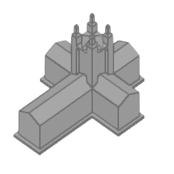

    

<h3 align="center">A digital imagining of the Cathedral board game.</h3>

Built with Godot 4.2 by Alec Watkins, Conner Lindsey, Ahyoung Jeong, and Bolu Akindele.

    

## CSC 445 Cathedral
CSC 445 Cathedral is a digital, isometric version of the Cathedral board game built in Godot 4.2 for the CSC 445 class.

## How to Play
This game abides by all of the [standard Cathedral rules](https://cathedral-game.co.nz/about-how-to-play.html), offering a single player mode against a CPU opponent and a couch co-op multiplayer mode.

This game is intended to be played with a keyboard and mouse using the following hotkeys:
* **[R]**: Rotate the selected piece.
* **[X]**: Cancel the placement of the selected piece.
* **[C]**: Toggle the camera perspective between isometric and top-down views.
* **[Q]** or **[E]**: Rotate the camera left and right respectively.

## Build
A Windows build is provided in the [build](/builds) folder.

There is also a Windows build provided in the [releases](https://github.com/awatkins23/Cathedral-CSC445/releases) section of this repository.

Alternatively, the game can be built from source using Godot Engine 4.2.2.
